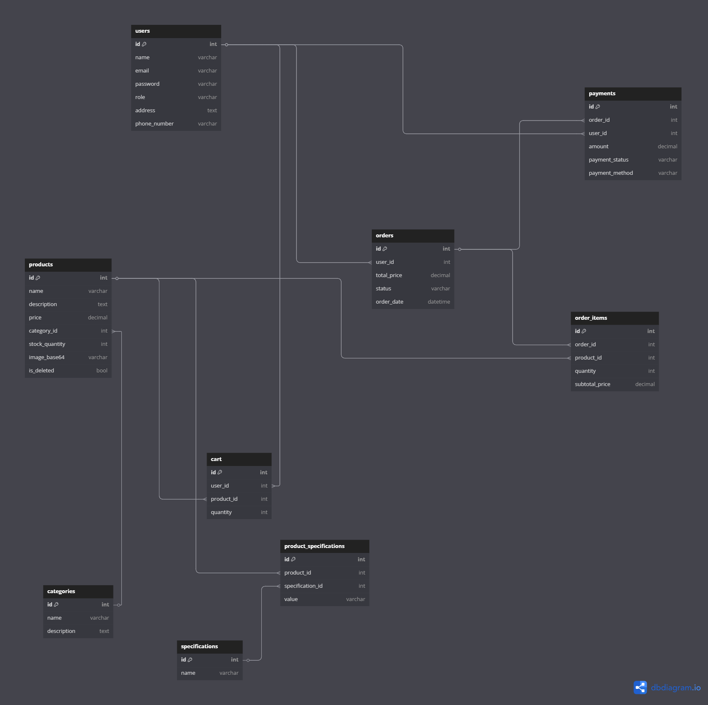

# 📌 Setting Up the Environment

## 1⃣ Create a `.env` File

In the **root directory** of your project, create a file named `.env` and add the following keys:

```env
PORT=your_port_number
JWT_SECRET=your_secret_key
MONGO_URI=your_mongodb_connection_string
```

🔹 **Note**: The `MONGO_URI` value will be assigned after creating a MongoDB cluster.

---

## 2⃣ Setting Up MongoDB

Follow these steps to set up your MongoDB connection:

### 🔹 **Create a MongoDB Cluster**

1. **Go to [MongoDB Atlas](https://www.mongodb.com/atlas/database)**.
2. Click **Create New Project** → Enter a project name → Click **Next** → Click **Create Project**.
3. Click **Create Cluster** and follow the setup instructions.

### 🔹 **Configure Database Access**

4. **Copy the username & password** generated during the setup.
5. Navigate to **Network Access** → Set **Current IP Address** to `0.0.0.0/0` (allows all connections).

### 🔹 **Get the Connection String**

6. Go to **Clusters** → Click **Connect** → Choose **Drivers**.
7. **Copy the connection string** and replace `<username>` and `<password>` with your credentials.
8. Assign this connection string to `MONGO_URI` in your `.env` file.

---

## 3⃣ Install Dependencies & Start the Project

Run the following commands in your terminal:

```sh
npm install
npm start
```

🚀 Your application is now set up and ready to go! 🎉


